# GenderNews Atlas: How Robust Are NLP Measurements of Changing Gender Representation in News?

_Gary Wang · GenderNews Atlas project · manuscript generated from frozen results (git `2dfc1b5`, frozen 2026-09-11)_

> **Disclosure.** The pipeline, analyses, reference annotations and first draft of this text were produced by an AI research agent (Claude) working under the author's direction. The reference labels used for validation are therefore AI-produced, not human annotations (§5). Every number in this document is generated from the repository's result files.

## Abstract

We measure how U.S. newspapers represented people signalled as women and as men between 1900 and 1963, and we test how far the answer depends on the NLP method used to obtain it. From 220,221 articles sampled from AmericanStories (22 years, 10,000 articles each), we extract 1,062,339 person-in-article entities. We assign gender only from textual evidence (honorifics and local pronouns), never from first names. 74% of entities carry no such evidence and are kept as UNKNOWN. Among gender-signalled people, women's share increased: +3.11 percentage points per decade (95% CI +1.41 to +4.81), from 55.3% in 1900–21 to 68.3% in 1948–63. Adjusting for topic and newspaper composition moves this slope to +0.47 (95% CI −1.33 to +2.27). We measure authority roles five ways on the same people: rule-based lexical and dependency methods, a supervised bag-of-words model, a contextual-embedding classifier, and an open-weights LLM. The estimated trend in women's share of authority roles ranges from +1.30 to +3.37 points per decade across methods. Across 900 analysis specifications, 899 give a rising women's share. Of seven pre-registered hypotheses, 3 are supported, 3 tentative and 1 unsupported. The largest measurement risks are the UNKNOWN pool, differential classifiability by gender, and the 1923 change in the digitised corpus.

## 1. Introduction

Computational studies of gender in news usually report one trend from one pipeline. Behind that trend sit several choices, each defensible and each consequential: what counts as a person, what counts as evidence of gender, what counts as a role, and which newspapers are in the corpus at all. This paper treats those choices as the object of study. It asks two questions together: how did gender-role representation in U.S. newspapers change between 1900 and 1963, and which parts of that answer survive reasonable changes of measurement?

Contributions: (i) a reproducible pipeline for person-level gender and role measurement on historical OCR, using only textual gender signals and keeping UNKNOWN as a category; (ii) a five-method comparison of role measurement on one shared population, with validation against stratified reference labels; (iii) an explicit treatment of corpus composition, including the post-1922 digitisation cliff; and (iv) a multiverse robustness analysis, with hypotheses frozen before any measurement was run.

## 2. Related work

Contemporary news counts find men mentioned and especially quoted far more often than women. The Gender Gap Tracker (Asr et al. 2021) reports men quoted about three times as often as women in Canadian online news. Jia et al. (2016) find women “seen more than heard”. The Global Media Monitoring Project reports women as about a quarter of people seen or heard in the news in 2020. Longitudinal work on text has mostly used word embeddings: Garg et al. (2018) show embedding associations tracking occupational change across the twentieth century. Underwood, Bamman & Lee (2018) find gendered description of fictional characters becoming less differentiated since 1780, using pronoun-based character gender. On measurement, van Strien et al. (2020) show OCR noise degrading NER and parsing unevenly, and Antoniak & Mimno (2018) show embedding neighbourhoods to be unstable under small corpus changes. Rudinger et al. (2018) document occupational gender bias in coreference systems. Devinney et al. (2022) find that most NLP gender-bias work leaves its theory of gender implicit. Our design draws on Lappin & Leass (1994) for salience-based pronoun resolution, Monroe et al. (2008) for regularised log-odds, and Steegen et al. (2016) for multiverse analysis. The literature search was targeted, not systematic (see `research/novelty_memo.md`).

## 3. Corpus

We use **AmericanStories** (Dell, M., Carlson, J., Bryan, T., Silcock, E., Arora, A., Shen, Z., D'Amico-Wong, L., Le, Q., Querubin, P., Heldring, L. (2023). American Stories: A Large-Scale Structured Text Dataset of Historical U.S. Newspapers. NeurIPS 2023 Datasets and Benchmarks Track.): article-segmented OCR of U.S. newspapers digitised by the Library of Congress, released under CC-BY-4.0 over public-domain source text. For each of 22 years (1900–1963, every third year) we stream the year's archive and retain the first 10,000 articles that pass length (200–20,000 characters) and legibility filters. The archive's members are date-shuffled, so a streamed prefix should approximate a random sample. We test this against a complete download of 1963 (51,600 scans). The prefix's total-variation distance from the full year is inside the null distribution of equal-sized random samples for newspaper (p = 0.48), month (p = 0.23) and page position (p = 0.35).

The corpus changes composition sharply. Before 1922 the yearly sample draws on 274 newspapers on average; from 1924 on, on 57. The Washington *Evening Star* rises from 2.1% of sampled articles in 1900 to 57.3% in 1963. Near-duplicate articles (MinHash, Jaccard ≥ 0.8, within year) make up 0.04% of the sample, so wire-copy duplication is negligible at this sampling density. Figure 1 summarises the corpus.

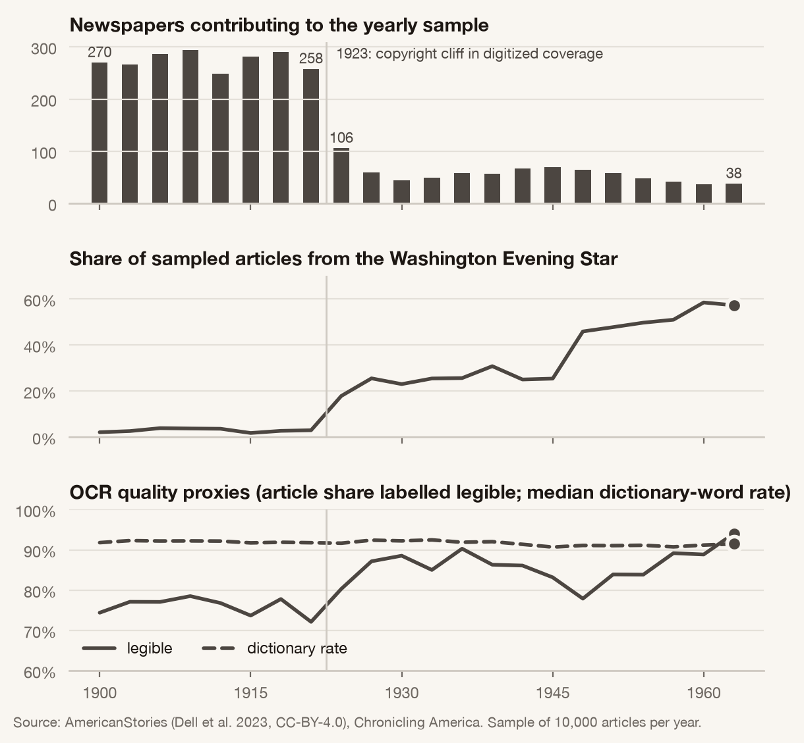

## 4. Measurement framework

**Units.** The primary unit is the *person-in-article entity*: spaCy `PERSON` mentions resolved within an article. Mentions, articles and speech events are separate units and are never mixed in a model.

**Entity resolution.** Mentions carrying different courtesy-honorific classes are never merged. This keeps “Mrs. Robert Jones” (a period convention for naming wives) apart from “Senator Robert Jones”, so his office cannot attach to her. Surname-only mentions attach only when the attachment is unique. One construction defeats this: in “Capt. Clayton Bissell … Mrs. Bissell” the surname-only *Mrs.* attaches to the husband's titled full name. A cluster that joins a female honorific with any other title is therefore treated as more than one person, and all its gender tiers are set to UNKNOWN. This rule (decision D17) was added after the first results were seen; the earlier behaviour is kept as a robustness dimension. Couples named without a title cannot be detected this way and remain an error source.

**Gender signal.** Tier 1 is a courtesy or noble honorific. Tier 2 is the first *he/she*-family pronoun after a salient mention, within the next sentence, with no intervening person or human noun; salience means subject preference, after Lappin & Leass (1994), and entity-level assignment needs two-thirds agreement. Anything else is UNKNOWN. Gendered nouns (*widow*, *actress*) form a sensitivity tier only, because several are also role terms. First names are never used. The primary rule is honorific + pronoun (`hp`).

**Roles.** Ten non-exclusive roles: public office, military, business, labour, professional, arts & sports, civic, society, family, crime & accident. The composite **authority** role (public office ∪ business ∪ professional) was fixed before outcomes were computed.

**Quotation.** A speech event is a verb from a fixed speech list whose subject is a person mention. Quotation marks alone never count without an attributed speaker.

## 5. Validation against reference labels

We drew a stratified random sample of 547 entities (four periods × honorific class × method-B role present) and labelled each blind to all method outputs, following `research/annotation_protocol.md`. **The labels were produced by the AI research agent, not by human annotators.** They measure agreement with a careful, protocol-bound reader, which is enough to separate methods from one another. They do not replace human validation, and we report them as reference labels, not gold. All accuracy figures are reweighted to population proportions.

NER precision is low on historical OCR: 69.6% of sampled entities are real person references. The primary gender rule assigns the correct signalled gender in 92.2% of the cases where it assigns one. On the full corpus, the pronoun tier agrees with the honorific for 90.7% of the 27,065 people carrying both signals, a large-sample accuracy check that needs no annotation. F1 for the authority role against reference labels: A 0.66, B 0.48, C 0.38, D 0.59, E 0.84 (Figure 9).

**Error differs by gender.** Among people the primary rule signals as women, method B's authority precision is 0.43 (recall 0.24, 21 predicted positives); among men it is 0.96 (recall 0.35, 75). For method A the figures are 0.27 and 0.92. Authority precision is lower among women than among men for 5 of the 5 methods (A 0.27 vs 0.92; B 0.43 vs 0.96; C 0.43 vs 0.62; D 0.13 vs 0.50; E 0.60 vs 0.75), on only 12 reference women who hold an authority role. False positives among women, such as officers of clubs and church societies read as holders of office, inflate the *level* of women's measured share of authority roles. The reference sample is too small to say whether they also move its trend, so the H2 results below are read with this bias in view.

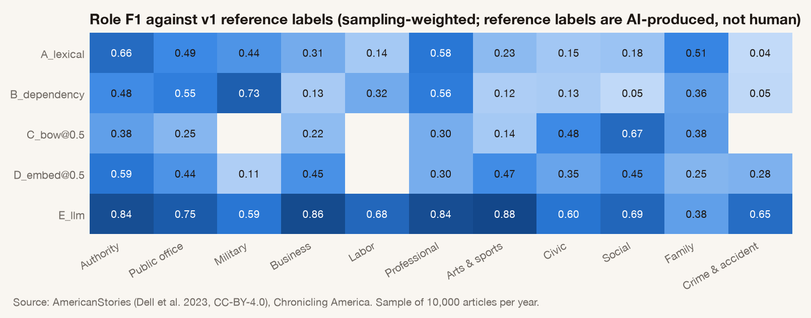

## 6. NLP methods

**A — lexical window:** any role noun within ten tokens in the same sentence, part-of-speech filtered so the baseline is fair rather than a strawman. **B — dependency rules:** titles, appositives, copular and appointment predicates, organisational heads typed by their organisation, and passive harm predicates. **C — supervised bag-of-words:** logistic regression on position-marked context n-grams with the name masked. **D — contextual embeddings:** MiniLM token states pooled over the name and its context, with a logistic head. C and D are cross-fitted on the reference labels with sampling weights. **E — LLM:** Qwen3-8B (open weights, served by a hosted provider through the author's gateway), JSON output at temperature 0, with prompt hash and timestamp recorded per call.

## 7. Temporal modelling

Yearly shares carry article-cluster bootstrap CIs. Trends are weighted least squares of the yearly series on decade, with Newey–West HAC standard errors, reported in percentage points per decade. Annual points are never treated as independent. Composition adjustment uses a linear probability model with year, topic and newspaper effects and standard errors clustered two ways (newspaper, year). The early–late change is decomposed by symmetric Kitagawa shift-share.

## 8. Results

**Visibility (H1, tentative).** Women's share of gender-signalled people increased (+3.11 pp/decade, 95% CI +1.41 to +4.81; Figure 3). Across the multiverse, 899 of 900 specifications give a positive slope; the range is −0.27 to +5.84.

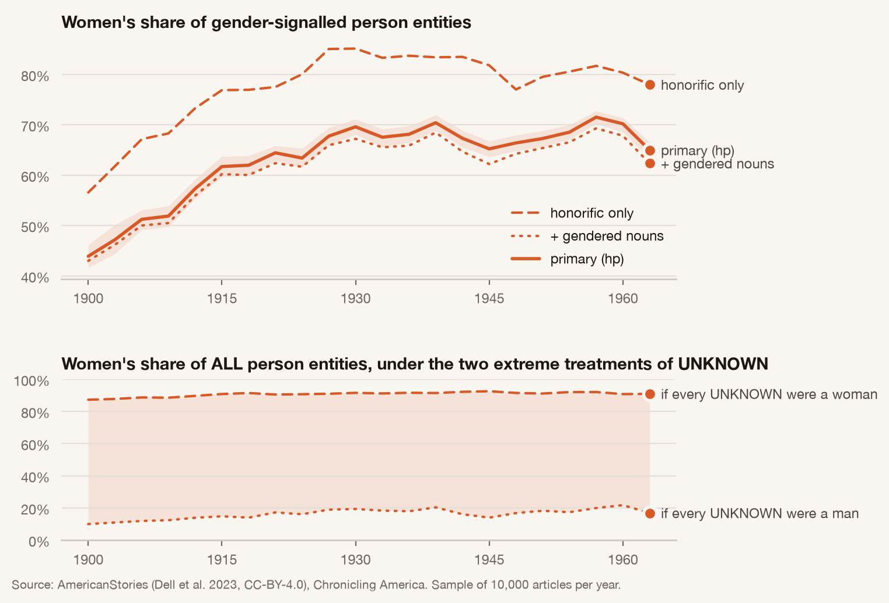

**Classifiability (H6, tentative).** The UNKNOWN share moves from 77.3% to 74.1% (−0.65 pp/decade, 95% CI −1.02 to −0.27; Figure 2). Under the extreme allocations of UNKNOWN the trend in women's share of *all* people is +1.19 (all UNKNOWN men) to +0.55 (all UNKNOWN women) pp/decade.

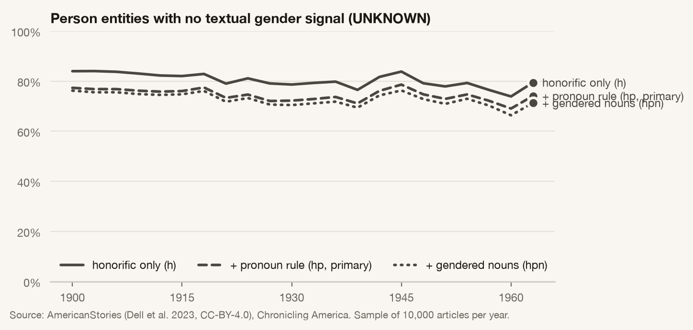

**Authority roles (H2, unsupported).** Under method A, women's share of authority roles is below their share of all people in every sampled year, and the gap changes by +0.01 pp/decade (95% CI −0.90 to +0.93). Under method B, women's share of authority roles is below their share of all people in every sampled year, and the gap changes by −0.08 pp/decade (95% CI −1.22 to +1.07). (Figures 4–5.)

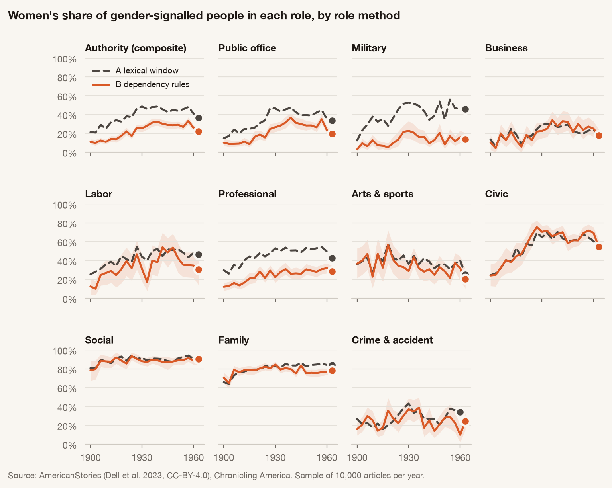

**Quotation (H7, supported).** Women's share of named speakers differs from their share of gender-signalled people by −44.73 points (95% CI −45.40 to −43.99; Figure 12).

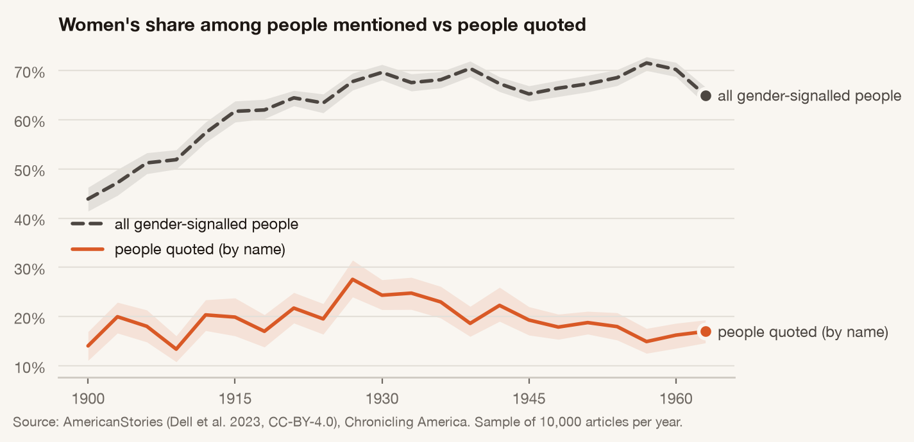

**Agency (exploratory).** The share of syntactic positions in which a person is the agent rather than the patient changes by −0.46 pp/decade for women (95% CI −0.65 to −0.27) and +0.44 for men (95% CI +0.21 to +0.67; Figure 13).

## 9. Method disagreement

On one shared population, the five methods give authority-role trends of A +3.37 (95% CI +1.02 to +5.72), B +3.22 (95% CI +1.34 to +5.10), C +1.30 (95% CI +0.08 to +2.51), D +2.00 (95% CI +0.80 to +3.19), E +1.35 (95% CI −1.02 to +3.71) pp/decade (Figure 8). Method E's estimate rests on only 266 people, a year-balanced random subsample of the others, so its interval is wide. H4, material divergence for at least one headline role, is **supported**. H5, that the lexical method gives the largest absolute trend, is **tentative** (3 of 5 headline roles).

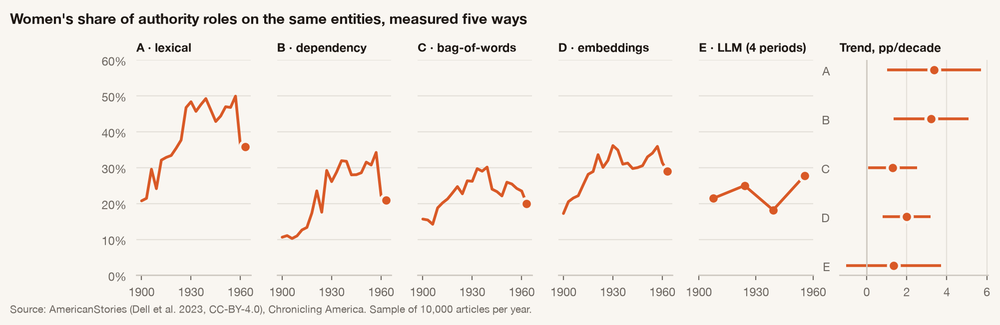

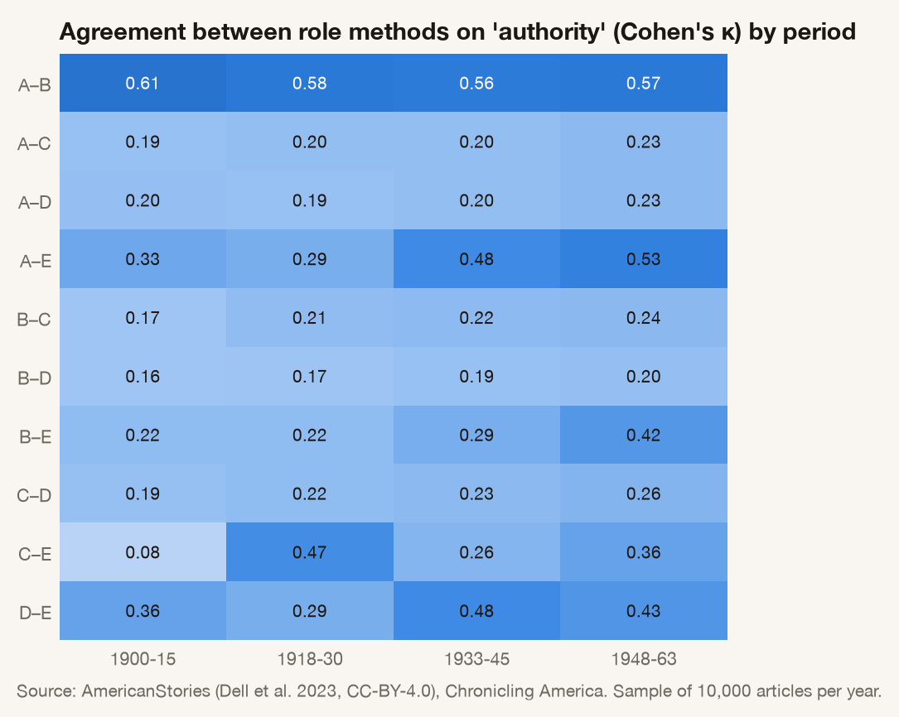

## 10. Composition adjustment

Raw and adjusted trends come from the same estimator. The raw slope is +3.11 (95% CI −0.86 to +7.08); with topic and newspaper fixed effects it is +0.47 (95% CI −1.33 to +2.27), a relative change of 85%. H3 is **supported**. Splitting the early–late change by newspaper group (*Evening Star* vs other papers) gives a total of +12.98 pp: −5.18 from composition and +18.16 within groups (Figures 6–7).

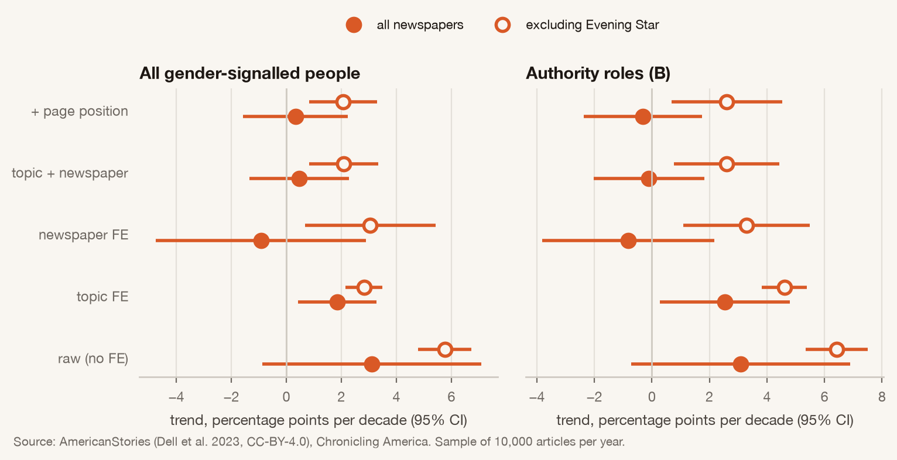

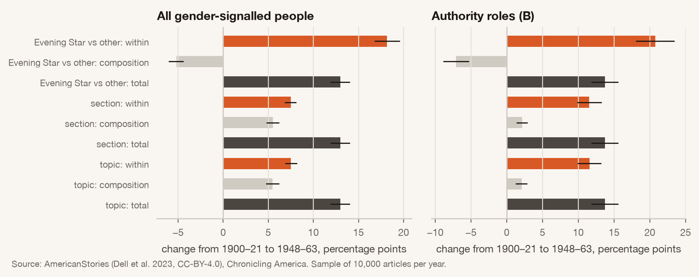

The topic model (NMF, k = 24) is moderately stable: mean matched cosine across seeds is 0.89, and article assignment agreement is 0.76, 0.77. Adjustment is therefore also reported at the coarse section level.

## 11. Robustness

Every headline estimand is recomputed across gender rule × person detector × duplicate handling × OCR filter × newspaper handling × time binning × content filter, plus method and classifier threshold for role estimands, and fixed-effects variants on a reduced grid (Figure 10). A claim is *supported* only if its sign survives every cell.

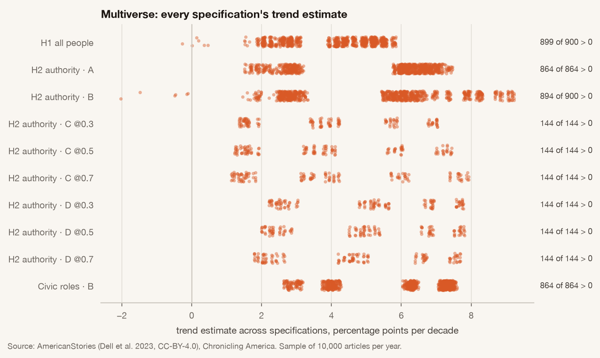

| Hypothesis | Claim | Status |
|---|---|---|
| H1 | The share of gender-signalled people who are signalled as women increases, 1900-1963. | **tentative** |
| H2 | Women's share of authority roles is below their share of all people in every period, and the gap narrows. | **unsupported** |
| H3 | Adjusting for topic and newspaper changes the 1900-1963 trend by at least 25% of the raw slope. | **supported** |
| H4 | Role-measurement methods produce materially different trend effect sizes (ratio > 2 or sign disagreement for at least one headline role). | **supported** |
| H5 | The lexical method (A) yields a larger absolute trend than the context-aware methods (B, D). | **tentative** |
| H6 | The UNKNOWN share changes over time, and the women's-share trend is sensitive to how UNKNOWN is handled. | **tentative** |
| H7 | Among attributed quotations, women's share of speakers is lower than their share of gender-signalled people. | **supported** |

## 12. Discussion

<!-- Hand-written after results were frozen. Deliberately carries no numbers: every figure
     quoted in the paper is generated from results/, and this text points to sections and
     figures instead, so it stays true when results are regenerated. -->

**What rose, and where.** Among people the newspapers marked as women or men, the share
marked as women rose from 1900 to 1963 in every raw specification of the multiverse (§11).
Most of that rise is composition. Holding topic and newspaper fixed removes most of the
slope (H3, §10). Newspaper fixed effects alone remove all of it: within an individual
newspaper we detect no trend. The raw series therefore mainly records which newspapers,
and which kinds of content, fill the sampled pages. It does not record a change in how a
given paper wrote about people. After 1922 the corpus holds far fewer titles and is
dominated by the Washington *Evening Star* (§3). The topic mix also shifts toward topics
in which women are named more often.

The two-group decomposition by newspaper points the other way and puts the rise inside
the groups. That is because "all other papers" is not a stable set: its membership
changes sharply at 1922. We read the fixed-effects result as the more credible one, and
we treat the visibility trend as a fact about this digitised corpus, not about the
American press.

**Authority tracks visibility.** Under every role method, women's share of authority
roles rose (§9). But it rose in step with women's share of all people. The gap between
the two did not narrow under method A or method B, so H2 is unsupported. More women
appear in authority roles in these pages, but that is not evidence of a change in *which*
roles women were written into, relative to how often they were written about at all.
Every method over-assigns authority to women relative to the reference labels (§5). The
measured level of women's authority share is therefore inflated, and the true gap is
probably larger than the one we report.

**The method changes the size, not the direction.** The role methods agree that women's
share of authority roles rose. They disagree by more than a factor of two on how fast
(H4), and by far more for public office alone. Pairwise agreement between methods is low,
and it drifts across periods (Figure 14). The lexical window picks up roles from nearby
words, and it gives the largest trend in most headline roles (H5, tentative). A study that
reports one of these pipelines reports one point from a wide range of defensible answers.

**Errors are gendered.** Three measurement problems push the same way.

- Men are named by office or surname alone far more often than women. They therefore
  fall into UNKNOWN more often, which inflates women's share among classified people.
- Every role method is less precise about authority for women than for men.
- Couple constructions attach a husband's title to his wife. The titled cases are removed
  by decision D17; the untitled ones are not.

None of these reverses the sign of a headline trend: the UNKNOWN bounds keep it positive
(H6). But together they mean that *levels* of women's share, and above all their share of
authority roles, should not be read as facts about the period.

**The quotation gap is the firmest finding.** Women's share of named speakers sits far
below their share of people in every period. The gap widens across all four periods,
under name-only and name-plus-pronoun attribution alike (H7, Figure 12). It survives the
choices that move the other results because it compares two quantities measured on the
same people by the same rules.

It still rests on a speech rule with low recall (§5). Women's speech may more often be
reported in forms the rule misses: through a spouse, in a club secretary's report, or as a
*she said* far from the name. If so, the gap is overstated. The reference sample is too
small to test this by gender.

**The LLM reads roles well and gender badly.** Against the reference labels, the
open-weights LLM has the best authority-role F1 of the five methods. It also assigns a
gender to most of the people about whom the text says nothing (§5). As a role reader it is
strong; as a gender reader it is not usable without constraints. It was applied to a small
year-balanced subsample only, so its trend estimate is imprecise.

**What would change these conclusions.**

- Human re-annotation of the reference sample, which could move every validation figure.
- Coreference that handles couples and binding constraints.
- A corpus whose newspaper membership is stable across 1922. That would allow
  within-newspaper change to be estimated on more than a few titles after that year.

## 13. Limitations

The corpus is the digitised record, not the American press. The 1923 cliff and the *Evening Star*'s growth confound raw trends. Gender is a textual signal inside a binary, marital-status-marked honorific system. Men are more often named without honorifics, so women's share among classified people is plausibly biased upward. Reference labels are AI-produced and the reference sample is small. Modern NER on historical OCR has low precision. Trend inference rests on 22 time points. No claim is causal. The full list is in `research/limitations.md`.

## 14. Ethics

The study infers no one's gender identity and uses no first names. Source texts are public domain, and short excerpts appear only as evidence for labels. The LLM condition sent public-domain excerpts to a hosted inference provider. See `research/ethics.md`.

## 15. Conclusion

Whether American newspapers of 1900–1963 “represented women more” is not one number. It depends on who can be gendered from the text, on what counts as a role, and on which newspapers survived into the digitised record. The estimates that hold across all of these choices are the ones marked supported above. The rest are reported as tentative or unsupported, with the specifications that break them.

## Reproducibility

`make reproduce` rebuilds everything from the public corpus. Corpus manifest SHA-256 `8cc1fc71216729ba…`; results hashes, figure hashes, software versions and LLM prompt hashes are recorded in `results/release.json`.

## References

- Asr, F.T., Mazraeh, M., Lopes, A., Gautam, V., Gonzales, J., Rao, P., Taboada, M. The Gender Gap Tracker: Using Natural Language Processing to measure gender bias in media. *PLOS ONE 16(1):e0245533 (2021)*. https://journals.plos.org/plosone/article?id=10.1371%2Fjournal.pone.0245533
- Jia, S., Lansdall-Welfare, T., Sudhahar, S., Carter, C., Cristianini, N. Women Are Seen More than Heard in Online Newspapers. *PLOS ONE 11(2):e0148434 (2016)*. https://journals.plos.org/plosone/article?id=10.1371%2Fjournal.pone.0148434
- Garg, N., Schiebinger, L., Jurafsky, D., Zou, J. Word embeddings quantify 100 years of gender and ethnic stereotypes. *PNAS 115(16):E3635-E3644 (2018)*. https://www.pnas.org/doi/abs/10.1073/pnas.1720347115
- Underwood, T., Bamman, D., Lee, S. The Transformation of Gender in English-Language Fiction. *Journal of Cultural Analytics (2018)*. https://culturalanalytics.org/article/11035
- Dell, M., Carlson, J., Bryan, T., Silcock, E., Arora, A., Shen, Z., D'Amico-Wong, L., Le, Q., Querubin, P., Heldring, L. American Stories: A Large-Scale Structured Text Dataset of Historical U.S. Newspapers. *NeurIPS Datasets & Benchmarks (2023)*. https://huggingface.co/datasets/dell-research-harvard/AmericanStories
- van Strien, D., Beelen, K., Ardanuy, M.C., Hosseini, K., McGillivray, B., Colavizza, G. Assessing the Impact of OCR Quality on Downstream NLP Tasks. *ICAART / ARTIDIGH (2020)*. https://www.turing.ac.uk/news/publications/assessing-impact-ocr-quality-downstream-nlp-tasks
- Devinney, H., Björklund, J., Björklund, H. Theories of "Gender" in NLP Bias Research. *FAccT (2022)*. https://arxiv.org/abs/2205.02526
- Hamilton, W.L., Leskovec, J., Jurafsky, D. Diachronic Word Embeddings Reveal Statistical Laws of Semantic Change. *ACL (2016)*. https://aclanthology.org/P16-1141/
- Antoniak, M., Mimno, D. Evaluating the Stability of Embedding-based Word Similarities. *TACL 6:107-119 (2018)*. https://aclanthology.org/Q18-1008/
- Sap, M., Prasettio, M.C., Holtzman, A., Rashkin, H., Choi, Y. Connotation Frames of Power and Agency in Modern Films. *EMNLP (2017)*. https://aclanthology.org/D17-1247/
- Fu, L., Danescu-Niculescu-Mizil, C., Lee, L. Tie-breaker: Using language models to quantify gender bias in sports journalism. *IJCAI Workshop on NLP Meets Journalism (2016)*. https://www.cs.cornell.edu/~liye/tennis.html
- Rudinger, R., Naradowsky, J., Leonard, B., Van Durme, B. Gender Bias in Coreference Resolution. *NAACL-HLT (2018)*. https://aclanthology.org/N18-2002/
- Lappin, S., Leass, H.J. An Algorithm for Pronominal Anaphora Resolution. *Computational Linguistics 20(4):535-561 (1994)*. https://aclanthology.org/J94-4002/
- Monroe, B.L., Colaresi, M.P., Quinn, K.M. Fightin' Words: Lexical Feature Selection and Evaluation for Identifying the Content of Political Conflict. *Political Analysis 16(4):372-403 (2008)*. https://papers.ssrn.com/sol3/papers.cfm?abstract_id=1448450
- Steegen, S., Tuerlinckx, F., Gelman, A., Vanpaemel, W. Increasing Transparency Through a Multiverse Analysis. *Perspectives on Psychological Science 11(5):702-712 (2016)*. https://journals.sagepub.com/doi/10.1177/1745691616658637
- World Association for Christian Communication (WACC). Who Makes the News? 6th Global Media Monitoring Project (GMMP 2020). *GMMP report (2021)*. https://whomakesthenews.org/wp-content/uploads/2021/07/GMMP2020.ENG_.FINAL20210713.pdf
